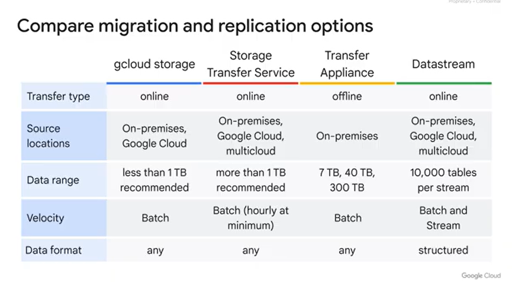
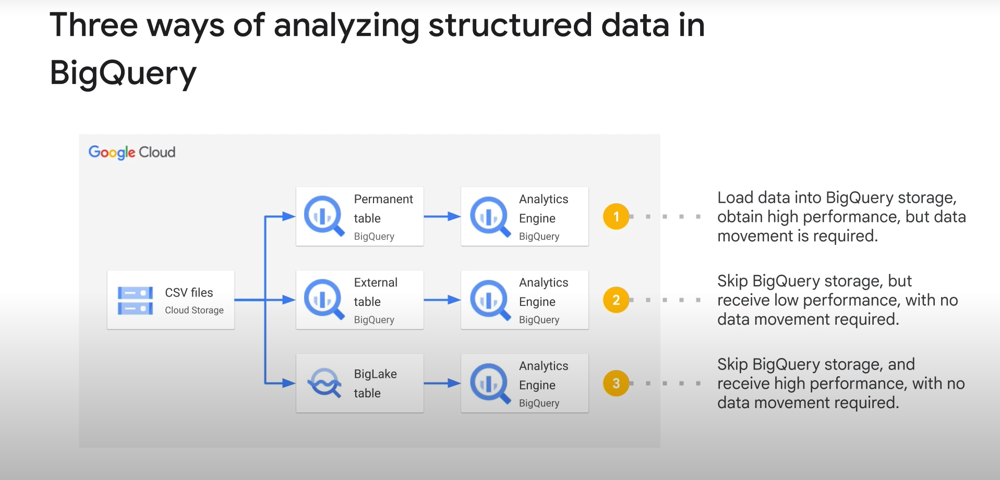

# Note for Professional Google Cloud Data Engineer Learning Path

*patcharanat p.*

## Table of Contents

1. [Introduction to Data Engineering on Google Cloud](#1-introduction-to-data-engineering-on-google-cloud)
    - [1.1 Course Introduction](#11-course-introduction)
    - [1.2 Data Engineering Tasks and Component](#12-data-engineering-tasks-and-component)
    - [1.3 Data Replication and Migration](#13-data-replication-and-migration)
    - [1.4 The Extract and Load Data Pipeline Pattern (EL)](#14-the-extract-and-load-data-pipeline-pattern-el)
    - [1.5 The Extract, Load, and Transform Data Pipeline Pattern (ELT)](#15-the-extract-load-and-transform-data-pipeline-pattern-elt)
    - [1.6 The Extract, Transform, Load Data Pipeline Pattern (ETL)](#16-the-extract-transform-load-data-pipeline-pattern-etl)
    - [1.7 Automation Techniques](#17-automation-techniques)
    - [1.8 Course Summary](#18-course-summary)

## 1. Introduction to Data Engineering on Google Cloud

### 1.1 Course Introduction

This section welcomes you to the Introduction to Data Engineering on Google Cloud course, and provides an overview of the course structure and goals.

### 1.2 Data Engineering Tasks and Component

This module provides an introduction to the role of a data engineer. It covers key concepts such as data sources and sinks, data formats, storage options on Google Cloud, metadata management, and the use of Analytics Hub for data sharing within and outside an organization.
- A data engineer builds data pipelines to enable data-driven decisions
- Data engineering tasks evolve around ingesting, transforming, and storing data
- Unstructure Data Storage - **Google Cloud Storage (GCS)**
    - can be accessed by HTTP requests
    - max object size = 5 TB
    - retrived by object name
    - Standard Storage = Application data
    - Nearline Storage = Database backups
    - Coldline Storage = Log files
    - Archive Storage = Compliance data
- Structure Data Storage
    - Transactional Workload SQL
        - SQL
            - **Cloud SQL**: Managed relational database service (RDBMS)
            - **AlloyDB**: Fully managed, high-performance PostgreSQL DB
            - **Spanner**: Fully managed relational database service, offering consistency and horizontal scalability
        - NoSQL
            - **Firestore**: Fully managed, serverless, NoSQL document database built for automatic scaling and high performance
    - Analytical Workload
        - SQL
            - **BigQuery**: Full managed, serverless data warehouse
                - BI, ML, project-dataset-table
                - bq command line tool included in Google Cloud SDK, REST API, Web-based SQL editor
                - Access control is through IAM with dataset, table, view, or column level 
        - NoSQL
            - **Bigtable**: fast key-value lookup
- Metadata is a key element to make data more manageable and useful across organization
    - **Dataplex**: comprehensive data management solution
        - Data to AI governance
        - Data governance in BigQuery
        - Insights and semantic search
        - Data Discovery and Data Catalog
        - End-to-end data lineage
- **Analytic Hub**: Address data sharing challenges between organizations by enabling publish-subscribe method to shared BigQuery datasets
    - data providers are able to control and monitor how their data is being used

### 1.3 Data Replication and Migration

This module provides an overview of data replication and migration on Google Cloud. It covers the basic architecture, the 'gcloud' command-line tool, Storage Transfer Service, Transfer Appliance, and Datastream, along with their functionalities and use cases.

- **Cloud Storage (GCS)**: file system, object store, or HDFS
- **Storage Transfer Service**: efficiently move medium-large datasets from on-premise, multicloud file systems, object stores, and HDFS
    - high transfer speed
    - **support scheduling**
- **Transfer Appliance**: is google's solution for moving large datasets **offline**
    - google provide hardwares
    - ideal for very large datasets and limited bandwidth
    - on-premises
- **Datastream**: enable continuous (real-time) data replication for on-premise / multicloud (to GCS or BigQuery)
    - historical backfill and new changes
    - New changes only
    - public / private connecticity options
    - include or exclude schema, table, column
    - Use cases
        - database replication to BigQuery
        - used with custom data processing in Dataflow to BigQuery
        - Data processing using even-driven architecture
    - use database's write-ahead log (WAL)
    - simplify data type conversion by using unified data type to ensure consistency

Apart from data storage type and services, amount of data (data size) and bandwidth also play a crucial role to transfer data between sources.



### 1.4 The Extract and Load Data Pipeline Pattern (EL)

This module focuses on data extraction and loading processes on Google Cloud, particularly with BigQuery. It covers the basic extraction and loading architecture, the bq command-line tool, BigQuery Data Transfer Service, and BigLake as an alternative to traditional extract-load patterns.

BigQuery supports loading data from various formats such as Avro, Parquet, ORC, CSV, JSON, Firestore export
- BigQuery also supports exporting artifact from query result into formats like CSV, JSON, Avro, Parquet
- BigQuery offer 2 ways to load data
    1. via UI
    2. SQL Statement to load suited for automating data loading
        ```sql
        LOAD DATA INTO dataset_name.table_name
        -- LOAD DATA OVERWRITE dataset_name.table_name
            FROM FILES(
                format='CSV',
                uris = ['gs://mybucket/*.csv']
            )
        ```

EL pipeline = bring data into destination (in this case is BigQuery) without upfront transformation
- `bq load` 
    - we can interact with BigQuery object with Google SDK's `bq` command such as creating dataset, loading data into a table, and etc.
    ```bash
    # example of loading data with bq command
    bq load \
        --source_format=CSV \
        --skip_leading_rows=2 \
        dataset-name.table_name \
        "gs://my-bucket/00/*.csv","gs://mybucket/01/*.csv" \
        ./table_schema.json
    ```
- **Data Transfer Service**: 
    - load data from other structure data sources (SaaS, Object Store, Data Warehouse, Third-party)
    - supports
        - scheduling, repeating, notification
        - managed and serverless
        - no-code solution
- BigQuery
    - Permanent table (Native Table)
        - Pros
            - High performance
        - Cons
            - Requires Data Movement to load to BigQuery Storage
    - **External tables**
        - Pros
            - No Data movement required, No BigQuery Storage
        - Cons
            - Low performance, No query cost estimation, No table preview, or No query caching
            - user needs separate permissions to access table and data source
        - Example of Data source
            - Cloud Storage
            - Google Sheets
            - Bigtable
    - **BigLake tables**
        - Pros
            - No BigQuery Storage, high performance with no data movement required, metadata caching available
            - Bigquery use service account to delegate access for data sources with "External Connection" feature
            - allow many data format: Iceberg, Delta, Hudi
            - allow cross-cloud (BigQuery Omni)
            - column-level / row-level security (column-level data masking and access)
        - Cons
            - No query cost estimation or table preview
        - Example of Data sources
            - Cloud Storage
            - Cross-cloud object store
    
    

### 1.5 The Extract, Load, and Transform Data Pipeline Pattern (ELT)

This module provides an overview of ELT (extract, load, transform) processes on Google Cloud. It covers the basic ELT architecture, a common ELT pipeline example, BigQuery's capabilities for scripting and scheduling SQL, and the functionality and use cases of Dataform.

Once data is loaded to BigQuery, there're multiple ways to transform:
- Procedural language
- Scheduled query
- Jupyter Notebook
- **Dataform**

*Note: Data must be loaded as Staging tables in BigQuery before further transformation to be Production tables*

### 1.6 The Extract, Transform, Load Data Pipeline Pattern (ETL)

This module provides an overview of ETL (extract, transform, load) processes on Google Cloud. It covers the basic ETL architecture, GUI tools, batch and streaming data processing options (Dataproc, Dataproc Serverless), and the role of Bigtable in data pipelines.

### 1.7 Automation Techniques

This module focuses on automation patterns and options for pipelines on Google Cloud. It covers various tools and services like Cloud Scheduler, Workflows, Cloud Composer, Cloud Run functions, and Eventarc, along with their functionalities and use cases for automation.

### 1.8 Course Summary

In this final section, we review what was presented in this course and discuss the next steps to continue your cloud learning journey.
